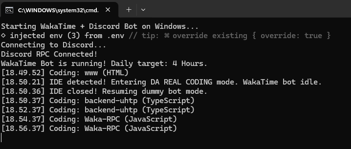

# 🤖 Waka-RPC

<p align="center">
  
</p>

A 2-in-1 bot that fakes your coding activity to **WakaTime** and syncs it beautifully with your **Discord Rich Presence**. Keep your GitHub WakaTime stats looking active with varied languages and projects, while maintaining a cool, subtle, and aesthetic status on your Discord profile!

## ✨ Features

- **WakaTime Spoofer:** Simulates coding activity by sending randomized heartbeats based on a list of projects.
- **Discord Rich Presence:** Shows what you are "coding" on your Discord profile.
- **Privacy Mode:** Masks your real project names on Discord (e.g., shows "Hobby Project" instead of the real name) while still sending the real name to WakaTime.
- **Auto-Rest Mode:** Automatically stops faking WakaTime activity after a specified daily limit (e.g., 3 hours) and changes your Discord status to "Resting/Idle".
- **Smart IDE Detection (DA REAL CODING Mode):** Automatically detects if you open a real IDE (VS Code, JetBrains, dll). It will pause the dummy bot and change your Discord RPC to show you're actually working!
- **Background Execution:** Run it silently in the background on Windows.

## 🚀 Installation & Setup

1. **Clone the repository**
    ```bash
    git clone https://github.com/yourusername/waka-rpc.git
    cd waka-rpc
    ```
2. **Install dependencies**
    ```bash
    npm install
    ```
3. **Configure Environment Variables**
    - Copy the `.env.example` file and rename it to `.env`:
        ```bash
        cp .env.example .env
        ```
    - Open `.env` and fill in your details:
        - `WAKATIME_API_KEY`: Get this from your [WakaTime Settings](https://wakatime.com/settings/account).
        - `DISCORD_CLIENT_ID`: Get this by creating an app in the [Discord Developer Portal](https://discord.com/developers/applications). Name your app something cool like "Horny Time" or "Code Master".
        - `DAILY_LIMIT_HOURS`: How many hours the bot should run before entering idle mode (default is 3).
4. **Configure Projects (Optional)**
   Open `projects.json` and customize the list of projects, languages, and file entities you want the bot to randomly simulate. The more varied, the more natural your WakaTime graph will look!

## 💻 How to Use

### Windows

- **Auto-Start on Boot:** Double-click `waka-startup-add.bat`. This will automatically configure the bot to run silently in the background every time you turn on your PC.
- **Remove Auto-Start:** Double-click `waka-startup-remove.bat` if you no longer want the bot to run automatically on boot.
- **Run in Background (Hidden):** Double-click `waka-run-hidden.vbs`. The bot will run silently without any console window.
- **Run in Console:** Double-click `waka-start.bat` if you want to see the real-time logs.
- **Stop the Bot:** Double-click `waka-stop.bat` to instantly kill the bot process.

### Linux / macOS

- **Run in Console:**
    ```bash
    node waka-rpc.js
    ```
- **Run in Background (Recommended):** Use [PM2](https://pm2.keymetrics.io/) to run the bot in the background.

    ```bash
    # Install PM2 globally
    sudo npm install -g pm2

    # Start the bot
    pm2 start waka-rpc.js --name "waka-rpc"

    # Stop the bot
    pm2 stop waka-rpc
    ```

    _(Note: If you run this inside WSL while Discord is running on Windows, the Discord RPC will fail to connect due to isolated IPC, but the WakaTime spoofer will still work perfectly)._

## 📝 Customizing Discord Status

If you want to change the text that appears on your Discord status (e.g., changing "Hobby Project" to something else), you can edit the `discordDetails` and `discordState` variables inside `waka-rpc.js`.

## 🧠 Smart IDE Detection

The script checks your background processes every 15 seconds. If it detects that you've opened a popular code editor or IDE (such as `VS Code`, `Cursor`, `Antigravity IDE`, `IntelliJ IDEA`, `WebStorm`, `Sublime Text`, dll), it will:

1. **Pause** sending fake coding heartbeats to WakaTime (idle mode).
2. **Switch** your Discord RPC to **"DA REAL CODING 💻"** to let everyone know you are doing real work.
3. Automatically **Resume** the dummy bot when you close your IDE.

You can customize the list of detected IDE executables in the `ides` array inside `waka-rpc.js`.

---
<p align="center">
  
  <br/>
  <i>Behind the scenes: The terminal log showing the WakaTime spoofing and IDE detection in action.</i>
</p>

_Disclaimer: Use this bot responsibly. It is intended for personal aesthetic and activity simulation purposes._
